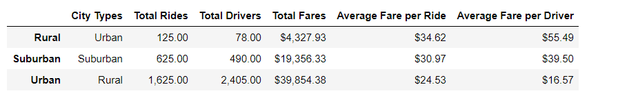
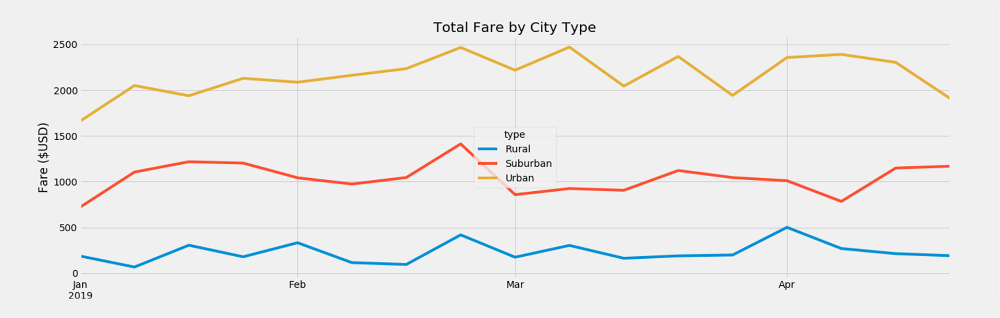

# Pyber_Analysis

Overview of the analysis:

The purpose of this analysis is trying to compare the fares charged in diffferent city types and find out the trend and relationships between the fares and the months.

Results:

Although "average fare per rides"and "average fare per driver" are highest in rural area, but amount of rides and drivers are less in rural city. Total fare through January to April, rural city type has the lowest aggreage fare. By contrast, urban city type has the highest aggregate fare. Additionally, the 3 different city types have roughly the same rate over time of fare collected. 

Summary:

The recommedation for CEO is the drivers should be allocated based on the demands from different area. For example, drivers can be allocated to rural area more to better increase the revenue. Fares should be decreased in rural area and should be increased in urban area.

